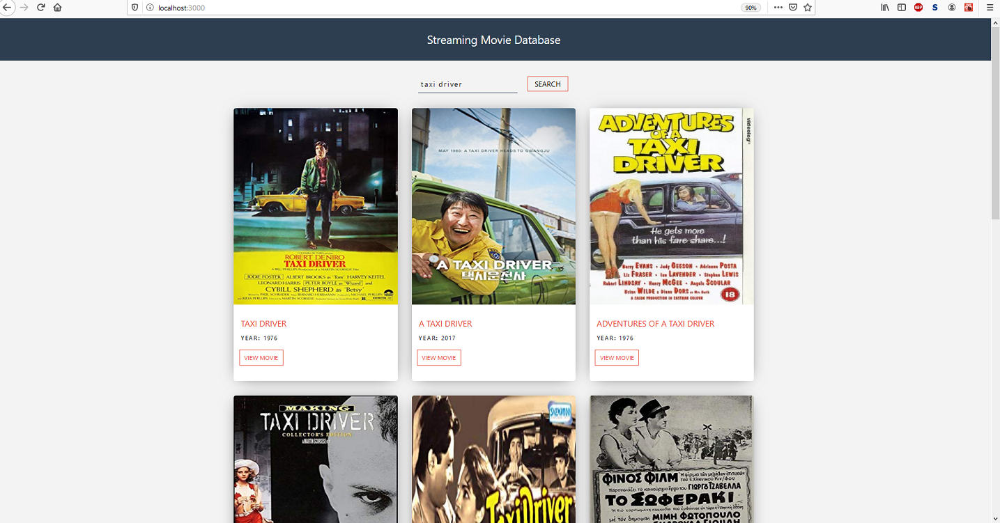
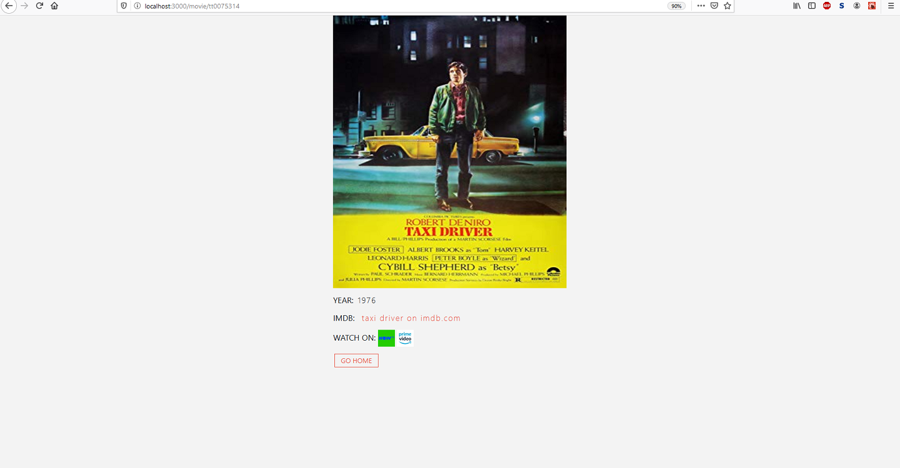

<h1>Streaming Movie Search Database</h1>

Just a quick test trying out REACT

This site allows you to search for any movie, and shows you which streaming
websites offer the movie on their platoform, with a direct link to the movie
on the chosen streaming site.

Uses the OMDb (open movie database) api to pull down movie names/year/poster 
for each searched film.

Uses the unofficial JustWatch api to get streaming options.

<h2>Project Screen Shots</h2>

<h2>Installation and Setup Instructions</h2>

Clone down this repository. You will need node and npm installed globally on your machine.

Installation:

Navigate to reactmoviedb directory.

npm install

To Start Server:

npm start

To Visit App:

localhost:3000
